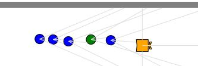
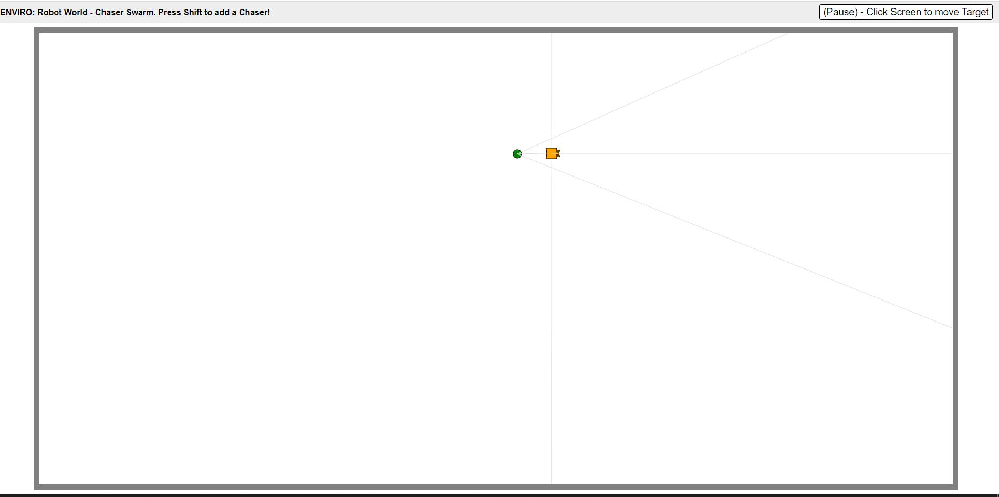

Final Project - Software Engineering For Embedded Applications
===

**Jonathan Day**
EE P 520A Winter 2020
---



Introduction
---
This Github repo has been created for the University of Washington Software Engineering For Embedded Applications class (EE P 520A).  In this repo, I will explain how to run this project on your system, what the funtionality is, and how this project can be expanded upon. 

Installation/Setup
---
To keep things consistent, I will describe the system I am using and assume the following;

- The system you are using to pull this code has a code editor that can compile C/C++. I am using Visual Studio and would recommend the same. 
- The system you are using has Git installed on it. To install Git, there are a few options:

    Mac
    ---
    - Install the Xcode Command Line Tools. These tools include git.

    Windows
    ---
    - Go to [https://git-scm.com/download/win](https://git-scm.com/download/win)

- Another portion of this project that is not common on normal Git pulls is the use of **Docker**
    - To install Docker go here: https://docs.docker.com/get-docker/
    - Docker is an open platform for developing, shipping, and running applications.
    - Docker allows the enviroment we are using to run various versions of Windows, Mac OS, and Linux.
    - Docker let’s us define a unix environment with exactly the pre-requisites the code needs.

- A helpful walkthrough can be found here (https://github.com/klavins/EEP520-W20/tree/master/week_1). Looking at this page will help explain in further detail some of the tools that were used for this project. 

After it is verified that you have installed both of these applications, your system should be ready to pull the project. I'm going to briefly explain setting up a folder, but it should be easy to tell once you clone the github repo. 

Installation
---

Create a file folder on your system to download this code. I will refer to this below as "Source File". You can create a new folder using the terminal in your editor and the commands:

```bash
mkdir "Source File"
```

You can create this file using whatever name you want, just keep it consistent. `cd` into this directory using the terminal line, and then clone this repo into that directory. To clone this repo into that source file using the terminal command line:

```bash
git clone https://github.com/jonday3/Tracker-Swarm
```

There now should be files within your newly created "Source File" directory. 

Running the Code
---
To run this project, there will be a combination of repos to pull from. I will be leveraging the repo's created by Professor Klavins. Run the following command in the terminal:

```bash
docker run -p80:80 -p8765:8765 -v /c/your_path../"Source File":/source -it klavins/enviro:v1.6 bash
```

"your_path" and "Source File" apply to your system. For example, my system uses my name "Jon Day", and needs these quotaion marks to properly execute the Unix command. "Source File" is your source directory we created, and will have files in it after the clone line is executed. 

Other Debugging:
    - Make sure that docker is running.
    - Make sure that the port you are using is not running another process.
    -Check that you have the most recent version (1.6 as of 3/17)
    - cd into the Tracker-Swarm folder you created. 

You should see a line in the terminal that looks something like

```bash
root@XXXXXXXXe5:/source# 
```

After you see this, you are now using the docker image in professor klavins enviro source code. Let's start the system, and then dive into the underlying code. To start this project, use the terminal and run:

```bash
root@39167803b0e5:/source# esm start
```

This will start the esm environment on your systems internet port (Port 80 from the docker image).

 > http://localhost
    with your web browser and see the ENVIRO client. It should say "Error: Failed to fetch. Is the server running?" at this point. 

Now run

```bash
root@XXXXXXXXe5:/source# enviro
```

Head to the local host tab, and you should see something like the following:



